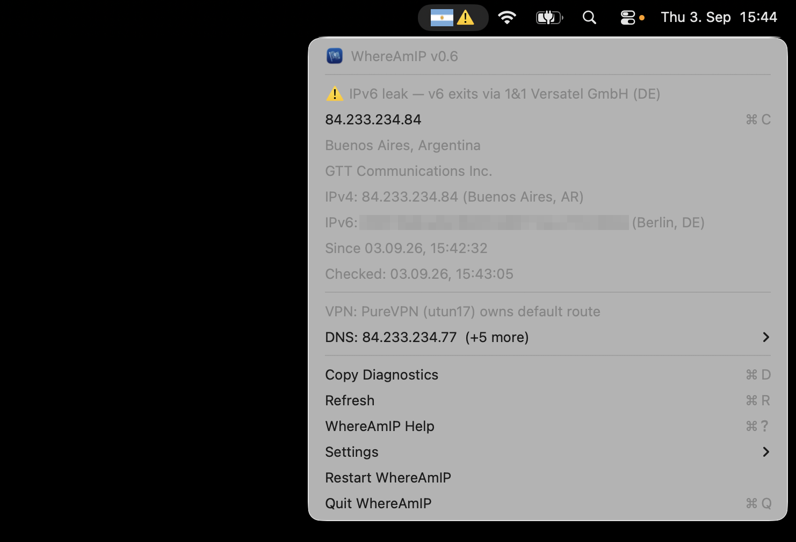

<p align="center">
  
</p>

# WhereAmIP

> Where am I(P)? — a native macOS menu bar app that shows the country flag of your current internet exit point, tells you when your connection is *actually* dead, and untangles what your VPNs and iCloud Private Relay are really doing to your traffic.

Stylized as **WhereAmIP** in the UI; the process, repo, and Homebrew formula name are lowercase `whereamip`.

<!-- TODO: take a real screenshot of the menu open (⌘⇧4) and drop it into docs/screenshot.png, then uncomment: -->
<!--  -->

## Features

- 🇩🇪 Country flag of your exit IP in the menu bar — flips to 🇳🇱 the moment a VPN grabs your default route, ❌ when the internet is unreachable (even when Wi-Fi claims otherwise)
- Real-reachability probe, not interface status — catches the "connected but blackholed" state
- Dropdown: public IP (click to copy), city/country, ISP/org, which VPN interface owns the default route, last-change timestamp
- iCloud Private Relay awareness — knows Safari may exit somewhere your apps don't
- Dual-stack IPv6 leak detection — probes your IPv4 and IPv6 exits independently (stack-pinned lookups, not a single dual-stack host); when a VPN owns the v4 route but IPv6 still exits natively and the two genuinely differ, a confirmed ⚠️ IPv6 leak warning shows up everywhere (menu bar badge, dropdown row, notification, CLI). Found in the field: PureVPN profiles that tunnel only IPv4 while native IPv6 keeps leaking via the home ISP
- DNS resolver display and leak detection — shows which resolvers macOS uses (per interface) and whether encrypted DNS (DoH/DoT profile) is in force; an optional active check discovers **all** of your load-balanced egress resolvers, not just one, via a round of six cache-busting TXT lookups (random names under `test.dnscheck.tools`, sent through mDNSResponder on each full refresh) and verifies that queries exit through the VPN tunnel. The dropdown's DNS row opens into the full picture: configured resolvers with their interface attribution, and every egress resolver with operator, location, and transport. `config set dns false` disables the check entirely, so no such query is ever sent
- Copy what you're looking at: **⌘C** copies the exit IP, **⌥⌘C** (hold Option) copies both exit addresses, IPv4 and IPv6, and **⌘D** copies a full diagnostics report — every row of the dropdown, warnings included, as plain text, ready to paste into a bug report (`whereamip diagnostics` prints the same thing). It warns about exactly what the app is warning about: no alarm the dropdown isn't already showing, and conditions that are worth noting without being alarming (leftover OpenVPN hijack routes on a connection that works) appear as plain facts on the line they belong to. The DNS submenu copies its resolver lists in bulk, bare addresses one per line
- **⌘? opens a help window** — what the menu bar symbol means, Since vs Checked, how to read the DNS submenu, every keyboard shortcut, and the CLI. A menu bar accessory has no Help menu, so this row is the substitute
- Three menu bar styles: emoji flag (🇩🇪), ISO country code (`DE`), or crisp flag image — pick per taste in Settings; ISO code is the monochrome, accessibility-friendly option (🇳🇱 vs 🇱🇺 at 16 px is hard, `NL` vs `LU` isn't)
- Full functionality via CLI (`whereamip status --json`)
- Notifications (off by default) — alerts on exit, route, or connectivity changes; launch at login
- Quiet update hint — checks the latest GitHub release daily and whenever you hit Refresh; when one's out, a single dropdown row lets you copy `brew upgrade whereamip`. Once brew has installed it, the row becomes "↻ Restart to finish update" — one click relaunches into the new version. No popups, no badges, respects your Settings, and the app itself never downloads or self-updates — brew does
- One-time welcome window on first start (and once after major releases): what the app is, where it lives, and live toggles for Launch at Login, Add to Applications folder, and Show Notifications — no permission prompts unless you flip a toggle. Reopen it anytime via Settings
- Honest freshness: the dropdown shows both "Since" (when the current state began, to the second) and "Checked" (when it was last verified), and a manual Refresh shows a brief loading cue in the menu bar
- Native AppKit (`NSStatusItem` + `NSMenu`), zero third-party runtime dependencies, no API keys

## Install

Installation uses [Homebrew](https://brew.sh), the standard package manager for macOS — if you don't have it yet, it's a one-line install from [brew.sh](https://brew.sh).

```bash
brew tap frinsen/tap
brew trust frinsen/tap   # newer Homebrew requires explicitly trusting third-party taps
brew install whereamip
```

This is a build-from-source formula (Xcode command line tools required) — no Gatekeeper dance, no unsigned-binary warnings.

### Start the app

```bash
open "$(brew --prefix)/opt/whereamip/libexec/WhereAmIP.app"
```

Then enable **Settings ▸ Launch at Login** inside the app so it starts automatically next time. A first-start window also walks you through this — it offers Launch at Login and Add to Applications folder as live toggles the moment the app opens for the first time.

Optional — make it show up in /Applications (the symlink survives upgrades); the first-start window's "Add to Applications folder" toggle (or **Settings ▸ Add to Applications folder** any time after) does this for you, but the manual `ln -s` below still works too for CLI-only folks:

```bash
ln -s "$(brew --prefix)/opt/whereamip/libexec/WhereAmIP.app" /Applications/WhereAmIP.app
```

> If Launch at Login stops working after a `brew upgrade`, re-toggle it in Settings.

## CLI

```bash
$ whereamip status
🇩🇪 203.0.113.7  Berlin, DE
   Deutsche Telekom AG
route: en0

$ whereamip status --json
{"connectivity":"online","exit":{"city":"Berlin","countryCode":"DE","ip":"203.0.113.7",...

$ whereamip watch            # prints a new status line whenever exit IP, route, or connectivity changes
$ whereamip watch --json

$ whereamip diagnostics      # paste-ready report for a bug report — same text the dropdown's ⌘D copies
WhereAmIP 0.4.2 — checked 17.08.26, 21:46:41
Warning IPv6 leak — v6 exits via Deutsche Telekom AG (DE)
Exit    104.28.225.96 · Berlin, DE · Cloudflare, Inc.
IPv6    2a09:bac5:27cd:2a0::43:80 · Berlin, DE
Route   Cloudflare WARP (utun17) owns default route
Since   17.08.26, 21:40:13
DNS     127.0.2.2, 127.0.2.3 (utun17)
        192.168.178.1 (en0)
Egress  162.158.245.7 · Cloudflare, Inc. (Berlin, DE) · UDP

$ whereamip config get       # notify=false / style=emoji / updates=true / dns=true
$ whereamip config set style code
$ whereamip config set notify true
$ whereamip config set updates false
$ whereamip config set dns false
```

## FAQ

**Is my VPN actually working?**
Look at the flag. WhereAmIP shows the country of your real exit IP in the macOS menu bar — the moment a VPN (Tailscale, OpenVPN, PureVPN, WireGuard, …) takes over your default route, the flag flips. The dropdown names the VPN that owns the route, based on the routing table, not on which apps happen to be running.

**How do I show my public IP in the menu bar on a Mac?**
`brew install` WhereAmIP, and your current public IP is one click away — with city, country, and ISP. Click the IP to copy it.

**Am I connected to the internet right now?**
WhereAmIP probes real reachability instead of trusting Wi-Fi status. If the network looks up but nothing actually loads (a classic stale-VPN symptom), the flag becomes an offline symbol — and if OpenVPN's leftover hijack routes are the cause, the dropdown says so.

**Why does Safari show a different location than my other apps?**
That's iCloud Private Relay: it carries Safari traffic through Apple's relay while other apps take the system route. WhereAmIP detects this split and shows both exits.

**Does it phone home?**
No — see Privacy below. No accounts, no API keys, no tracking.

**How do I debug it / attach logs to a bug report?**
Start with **⌘D** in the dropdown (or `whereamip diagnostics`): that copies a compact report of everything the app currently sees, warnings included, straight to your clipboard — nothing leaves your Mac. For a live trace, run `whereamip debug`, reproduce the issue, and paste that too. It streams WhereAmIP's diagnostic log — nothing is written to disk, before or after you run it.

## Privacy — your data stays yours

WhereAmIP has **no tracking, no analytics, no history, and no log files**. Nothing is written to disk except your display-style preference. The copy actions (⌘C, ⌥⌘C, ⌘D, and the DNS submenu's copy rows) write to your local clipboard and nowhere else — Copy Diagnostics assembles its report from what the dropdown is already showing (same data, same warnings, no alarm the app isn't showing you), sends nothing anywhere, and triggers no extra lookup of any kind. The only network requests are the documented lookups needed to answer "where do I exit right now" (keyless public geo APIs, a connectivity probe, the Private Relay check, and — for the dual-stack IPv6 leak detector — stack-pinned lookups to `api4.ipify.org`/`api6.ipify.org` over HTTPS) — your IP is never sent anywhere else, and past states are gone the moment they change. If you *want* a history, you opt in yourself: `whereamip watch --json >> your-own-file` keeps it wherever you decide.

The DNS leak check is the one part that sends DNS queries of its own: per full refresh it looks up the TXT record of up to six random names under `test.dnscheck.tools` (each name is used once, so nothing is cached and every lookup reaches that zone's authoritative server, which reports which resolver address asked). That server therefore sees your resolvers' egress addresses — the same thing every website you visit sees — and nothing else about you; the queries carry no identifier beyond the random label. If that service is unreachable, a single TXT lookup of Google's `o-o.myaddr.l.google.com` beacon serves as the fallback. Reading your resolver *configuration* needs no network at all and always works. Turn the check off with `whereamip config set dns false` (or the "Check for DNS Leaks" toggle in Settings) and no such query is ever sent.

WhereAmIP also checks `api.github.com/repos/frinsen/whereamip/releases/latest` once a day (and whenever you hit Refresh) to see if a newer release exists — this is a passive version check only, it never downloads or installs anything, it just shows a dropdown row that copies `brew upgrade whereamip` for you to run yourself. This check is on by default; turn it off with `whereamip config set updates false` (or the "Check for Updates" toggle in Settings) and no such request is ever made.

WhereAmIP does emit diagnostics through Apple's unified logging (`os.Logger`), but this creates no privacy problem: the app never writes a log file anywhere. Entries are logged at debug level, which macOS does not persist to disk by default — they exist only in the local system's in-memory ring buffer while you're actively streaming them with `whereamip debug` (or Console.app), and expire on their own shortly after. Nothing is collected, stored, or sent off your Mac.

## Roadmap

- **IPv6 hijack detection** (Phase 2 of the IPv6 leak detector): the v6 hijack pair (`::/1` + `8000::/1`), analogous to the existing OpenVPN IPv4 hijack detection; re-add IPv6 relay egress ranges.
- Faster far-end detection: a VPN server switch inside the same tunnel produces no local route event, so today the geo backstop (5 min) is the only trigger.
- Optional history: `whereamip watch --json >> file` already works as a manual log; consider last-N transitions in the dropdown.
- **Multi-language** (`de` first): *partially done.* All user-facing strings now live in `Sources/WhereAmIPUI/Resources/en.lproj/Localizable.strings`, and long-form content (the onboarding pitch, per-release what's-new highlights) in bundled Markdown under `Sources/WhereAmIPUI/Resources/welcome/` — centrally editable, and the what's-new window renders real release highlights instead of repeating the pitch. What remains is the translations themselves: a `de.lproj/Localizable.strings` beside the English one, German copies of the welcome Markdown, and a language choice for content files (the strings side is handled by macOS). CLI output stays English by design — it's a parseable API.
- **Install-aware update hint**: the update row currently always offers `brew upgrade whereamip` — misleading for people who installed from the release zip. Detect the install method from the bundle path (Homebrew Cellar vs. anywhere else) and have the row open the GitHub releases page instead for zip installs. Small and near-term.
- Sparkle self-updates for the zip channel: technically possible without an Apple Developer account (Sparkle's update trust rests on its own EdDSA signing, independent of Apple; the Gatekeeper dance stays a first-install-only affair). Deferred because it adds a third-party framework, an appcast feed, and private-key management, and must stay disabled for Homebrew installs — revisit once the direct-download channel has real users, ideally together with the notarization decision below.
- Signed & notarized downloads (needs an Apple Developer membership): would turn the unsigned release zip into a double-click install, enable a fast `brew install --cask` path, and drop the Gatekeeper caveats. Deliberately deferred until the project earns it — the build-from-source formula already installs cleanly without Apple's toll.
- Flag-image style polish: rounded corners + hairline border so the PNG flags hold up on any menu bar background (emoji and ISO styles are unaffected).
- Separate bundle id for dev builds (`….dev`): test bundles currently share settings and notification permissions with the installed app — convenient, but experiments can touch real state.

## Credits

Flag images by [Flagpedia.net](https://flagpedia.net) (public domain).

## License

MIT
